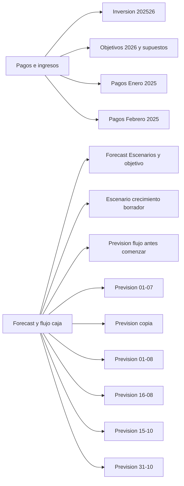
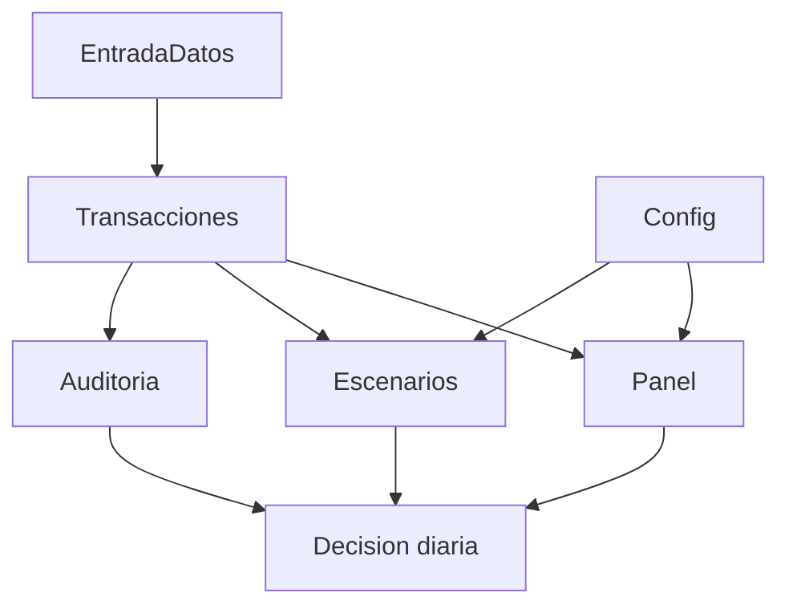

# Auditoria Ultra Profunda - Contabilidad y Forecast

Fecha: 2026-03-11
Proyecto: Contabilidad IA Visual (Booking)

## 1) Alcance y fuentes auditadas

Se auditaron en modo lectura:

- `Copia de 1. 2026 Pagos e ingresos .xlsx`
- `Copia de 1. Forecast y flujo caja 2026 (1).xlsx`
- Carpeta Drive: `1AfzavNZkHMjc4N_zXfQ6niOhQLXV81my`

Verificacion de integridad (Drive vs local):

- `Copia de 1. 2026 Pagos e ingresos .xlsx`: `sameBinary=true`
- `Copia de 1. Forecast y flujo caja 2026 (1).xlsx`: `sameBinary=true`

Conclusion: los archivos locales son binariamente identicos a los de Drive, sin diferencias por exportacion/descarga.

## 2) Inventario tecnico

| Libro | Hojas | Hojas ocultas | Celdas no vacias | Formulas | Graficos | Tablas | Pivots | Hojas sin validacion |
|---|---:|---:|---:|---:|---:|---:|---:|---:|
| Copia de 1. 2026 Pagos e ingresos .xlsx | 4 | 0 | 1,019 | 172 | 0 | 4 | 0 | 4 |
| Copia de 1. Forecast y flujo caja 2026 (1).xlsx | 9 | 7 | 4,182 | 1,496 | 6 | 0 | 0 | 9 |

## 3) Estructura encontrada

## 4) Hallazgos criticos

### Critico (P0)

1. Fragmentacion operativa: dos libros y 13 hojas funcionales para un unico sistema contable/forecast.
2. Control de calidad insuficiente: 13/13 hojas relevantes sin validaciones de datos.
3. Versionado manual de forecast por fecha (01-07, 01-08, 16-08, 15-10, 31-10): riesgo alto de inconsistencia y decisiones sobre versiones no canonicas.

### Alto (P1)

1. 7 hojas ocultas en el libro de forecast: reduce trazabilidad y aumenta dependencia de conocimiento tacito.
2. Ausencia de pivots para cierre financiero: analisis depende de lectura manual y no de una capa resumen robusta.
3. Flujo manual explicitado en cabeceras (ej. "COPIAR A MANO..."): riesgo de errores de digitacion y retraso de cierre.

### Medio (P2)

1. Mezcla de capas (datos + calculo + presentacion) en la misma hoja.
2. Sin capa central de catalogos (lineas de negocio, categorias, estados).

## 5) Analisis funcional

### Pagos e ingresos (operacion)

- Funciona como registro de movimientos y supuestos base.
- Aporta detalle transaccional util para alimentar un ledger unificado.
- Debilidad principal: no hay pipeline estandar de entrada -> validacion -> aprobacion.

### Forecast y flujo de caja (planeacion)

- Contiene logica de escenarios y snapshots historicos por fecha.
- Tiene material de alto valor (graficos y calculo), pero disperso en multiples pestañas.
- Debilidad principal: el proceso no es reproducible automaticamente desde una tabla maestra.

## 6) Recomendacion de unificacion (target)

Modelo objetivo con pocas pestañas (single source of truth):

1. `EntradaDatos` (formulario visual)
2. `Transacciones` (ledger canonico)
3. `Panel` (KPI + graficos de negocio)
4. `Escenarios` (optimista/base/pesimista)
5. `Auditoria` (reglas de calidad + incidencias)
6. `Config` (parametros y permisos)
7. `Log` (trazabilidad)

## 7) Mapeo de migracion de hojas actuales

| Origen | Destino unificado | Accion |
|---|---|---|
| Inversion 202526 | Transacciones / Config | Normalizar como movimientos de inversion y supuestos |
| Objetivos 2026 y supuestos | Config / Escenarios | Convertir supuestos a parametros de escenario |
| Pagos Enero 2025 y Pagos Febrero 2025 | Transacciones | Consolidar en ledger con fecha, tipo, linea, categoria |
| Forecast y Escenario crecimiento | Escenarios | Unificar logica en motor unico con 3 escenarios |
| Previsiones por fecha (01-07, 01-08, etc.) | Escenarios + Auditoria | Mantener como historico auditado, no como hojas activas |

## 8) Entregable tecnico ya preparado

Se ha creado una base de aplicacion (Apps Script) en `contabilidad-ia-booking/appscript` con:

- Formulario visual de entrada (`EntradaDatos`)
- Registro canonico (`Transacciones`)
- Panel automatico con KPI + graficos (`Panel`)
- Escenarios optimista/base/pesimista (`Escenarios`)
- Auditoria automatica de calidad (`Auditoria`)
- Resumen IA con fallback y opcion Gemini (`Resumen IA` en Panel)

## 9) Proximos pasos recomendados

1. Migrar historico de ambas hojas al ledger unificado.
2. Ajustar taxonomia final de lineas de negocio y categorias.
3. Activar clave IA y definir prompts de auditoria ejecutiva.
4. Cerrar validaciones de negocio (aprobaciones, cierres mensuales, reglas de excepcion).
